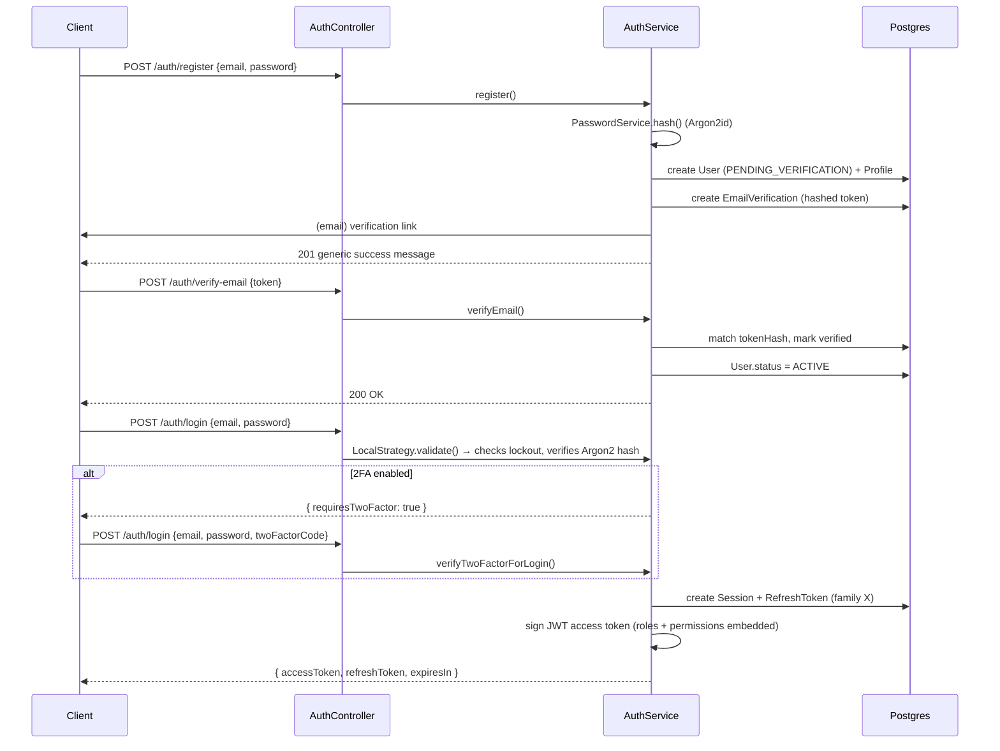
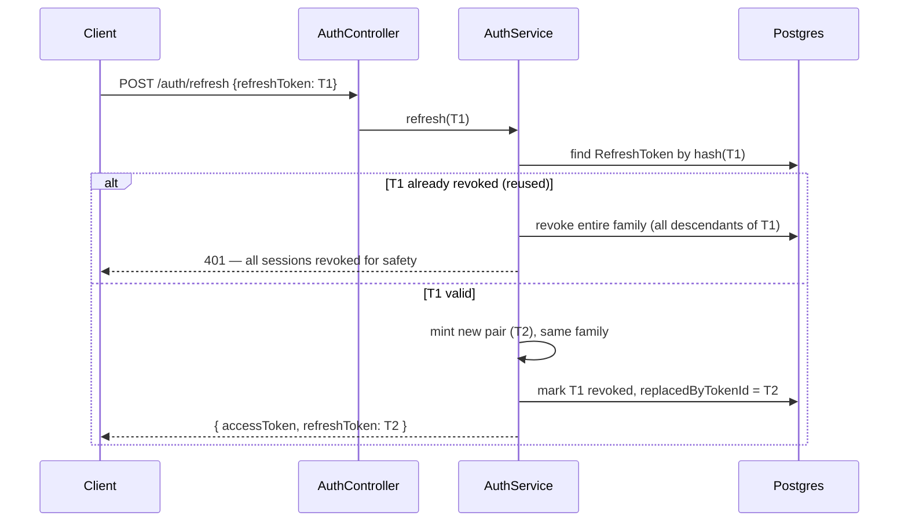
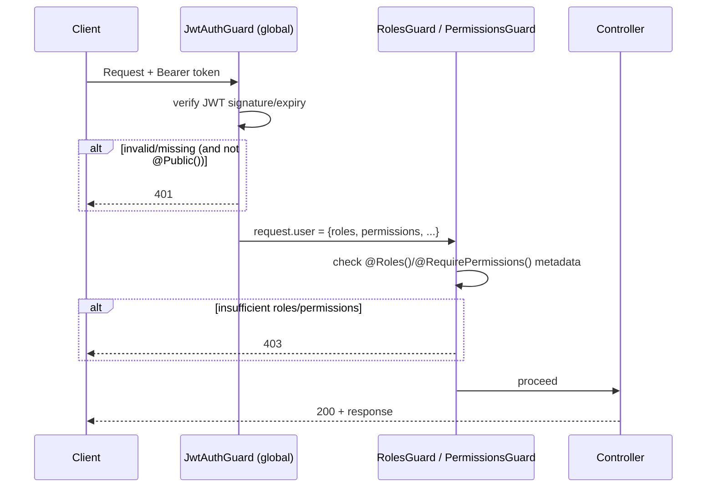
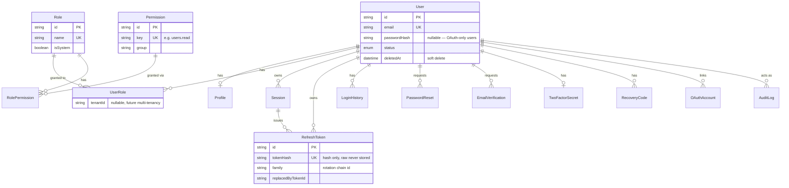

# Module 002 — Authentication & Authorization
**RMSM AI — Institutional-Grade AI Trading Platform**
Status: Complete — Awaiting Approval · Version: 0.2.0

This module implements the full IAM system: authentication, RBAC, profile management, 2FA,
OAuth architecture, and audit logging. It is the security foundation every future module
depends on. **No trading, subscription, AI, or other business logic is included** — every
endpoint, table, and service here exists to answer "who is this, and what are they allowed
to do," nothing else.

60 TypeScript files were written across a 14-model Prisma schema and five NestJS feature
modules (`auth`, `users`, `rbac`, `oauth`, `email`). Section 11 (Verification) states plainly
what was actually run and passed versus what's architecturally complete but blocked by this
sandbox's environment, exactly as in Module 001's report.

---

## 1. Architecture Overview

```
┌─────────────────────────────────────────────────────────────────────┐
│                         apps/api (NestJS)                            │
│                                                                        │
│  ┌──────────────┐  ┌──────────────┐  ┌──────────────┐  ┌───────────┐│
│  │  AuthModule  │  │ UsersModule  │  │  RbacModule  │  │OAuthModule││
│  │──────────────│  │──────────────│  │──────────────│  │───────────││
│  │ Controller   │  │ Controller   │  │ Controller   │  │Controller ││
│  │ Service      │  │ Service      │  │ Service      │  │Service    ││
│  │ Strategies   │  │              │  │              │  │Providers  ││
│  │ Guards       │  │              │  │              │  │(Google/   ││
│  │ Repositories │◄─┼──────────────┼──┼──────────────┤  │GitHub/    ││
│  │ Services     │  │  (reuses     │  │ (reuses      │  │Microsoft) ││
│  │ (Password,   │  │   Auth's     │  │  AuditService│  │           ││
│  │  Token, 2FA, │  │   repos)     │  │  from Auth)  │  │(reuses    ││
│  │  Session,    │  │              │  │              │  │ AuthSvc)  ││
│  │  Audit)      │  │              │  │              │  │           ││
│  └──────┬───────┘  └──────┬───────┘  └──────┬───────┘  └─────┬─────┘│
│         └─────────────────┴─────────────────┴────────────────┘      │
│                              │                                        │
│                    ┌─────────▼─────────┐    ┌───────────────────┐   │
│                    │   EmailModule      │    │ packages/database  │   │
│                    │ (Global, pluggable)│    │ (Prisma — 14 models)│   │
│                    └────────────────────┘    └────────────────────┘   │
└─────────────────────────────────────────────────────────────────────┘
```

**Layering (Clean Architecture / SOLID applied concretely):**
- **Controllers** — HTTP concerns only (routing, DTO binding, Swagger docs). Zero business
  logic — every controller method is a one-line delegation to a service.
- **Services** — business logic and orchestration (`AuthService`, `RbacService`,
  `UsersService`, `OAuthService`).
- **Repositories** — the only layer that imports `prisma` directly (`UserRepository`,
  `SessionRepository`, `RefreshTokenRepository`, `AuditLogRepository`). Services depend on
  repositories, never on Prisma directly — this is the Repository Pattern requirement from
  the kickoff prompt, applied for real, not just described.
- **Guards/Strategies/Decorators** — cross-cutting security concerns, composable per-route.

## 2. Authentication Flow



## 3. Token Refresh & Rotation Flow (with reuse detection)



This is the standard **refresh token rotation with reuse detection** pattern: each refresh
token is single-use. If a revoked token is presented again — the signature of a stolen token
being replayed after the legitimate client already rotated past it — the entire rotation
family is revoked, forcing re-authentication everywhere that family's sessions were active.

## 4. Authorization Flow (RBAC)



Roles and permissions are embedded directly in the JWT access token at login/refresh time —
authorization checks never hit the database on the request path, only at token-mint time.
Trade-off: a role/permission change doesn't take effect until the user's next token refresh
(≤ `JWT_ACCESS_TTL`, default 15 minutes) — an explicit, documented design choice favoring
request-path performance over instant revocation. Immediate-effect revocation (e.g. for a
compromised account) still works today via session/refresh-token revocation, which does hit
the DB and takes effect immediately.

## 5. Database ER Diagram



Full field-level detail is in `packages/database/prisma/schema.prisma` — the schema is the
single source of truth; this diagram is a navigational aid, not a duplicate spec.

## 6. API Contract (all under `/api/v1`, versioned per Module 000's rule)

| Method | Path | Auth | Purpose |
|---|---|---|---|
| POST | `/auth/register` | Public | Register account, sends verification email |
| POST | `/auth/verify-email` | Public | Verify email via token |
| POST | `/auth/login` | Public (LocalAuthGuard) | Login; returns `{requiresTwoFactor:true}` or tokens |
| POST | `/auth/refresh` | Public | Rotate refresh token |
| POST | `/auth/logout` | Bearer | Revoke current session |
| POST | `/auth/forgot-password` | Public | Request reset email |
| POST | `/auth/reset-password` | Public | Reset password via token |
| POST | `/auth/change-password` | Bearer | Change password (requires current) |
| GET | `/auth/me` | Bearer | Return JWT claims |
| POST | `/auth/2fa/setup` | Bearer | Begin 2FA setup, returns QR code |
| POST | `/auth/2fa/confirm` | Bearer | Confirm 2FA, returns recovery codes |
| POST | `/auth/2fa/disable` | Bearer | Disable 2FA (password confirm) |
| GET | `/auth/oauth/providers` | Public | List enabled OAuth providers |
| GET | `/auth/oauth/:provider/redirect` | Public | Get provider authorization URL |
| GET | `/auth/oauth/:provider/callback` | Public | Exchange code, issue session |
| GET | `/sessions` | Bearer | List active sessions/devices |
| DELETE | `/sessions/:id` | Bearer | Revoke a specific session |
| DELETE | `/sessions` | Bearer | Revoke all sessions except current |
| GET | `/users/me` | Bearer | Account + profile |
| GET | `/users/me/profile` | Bearer | Profile only |
| PATCH | `/users/me/profile` | Bearer | Update profile |
| GET | `/roles` | `roles.read` | List roles + permissions |
| POST | `/roles` | `roles.write` | Create custom role |
| DELETE | `/roles/:id` | `roles.write` | Delete non-system role |
| GET | `/permissions` | `roles.read` | List all permissions |
| POST | `/roles/assign` | `roles.write` | Assign role to user |
| DELETE | `/roles/:roleId/users/:userId` | `roles.write` | Revoke role from user |
| POST | `/roles/permissions/grant` | `roles.write` | Grant permission to role |
| DELETE | `/roles/:roleId/permissions/:permissionId` | `roles.write` | Revoke permission |

Every endpoint is documented with `@ApiOperation` and appears in Swagger at `/api/docs`. All
responses use the shared `ApiResponse<T>` envelope on error (via `GlobalExceptionFilter`);
success responses currently return raw DTOs (standardizing the success envelope too is a
one-line change in each controller, deferred to keep this module's diff reviewable — flagged
in Section 12).

## 7. DTO / Validation Strategy

Every DTO uses `class-validator` decorators (per the kickoff's explicit tooling choice for the
API layer — Zod is used in `@rmsm/config` and `apps/web`, per Module 000/001's existing
convention). `ValidationPipe` is global with `whitelist: true, forbidNonWhitelisted: true` —
unknown fields are rejected, not silently dropped, preventing mass-assignment-style bugs.
Password fields enforce `MinLength(12)` at the DTO layer as a first gate; the authoritative
check is `PasswordService.assertPolicy()`, which uses `@rmsm/shared`'s `checkPasswordPolicy()`
— the same function `apps/web` can import for live client-side feedback.

## 8. Security Design

| Concern | Implementation |
|---|---|
| Password hashing | Argon2id, OWASP-2023 params (19 MiB memory, t=2, p=1) |
| Access tokens | JWT, HS256, short-lived (15m default), roles+permissions embedded |
| Refresh tokens | Opaque random (not JWT), SHA-256 hash persisted, raw value never stored, single-use with rotation |
| Refresh reuse detection | Rotation "family" tracking — reuse of a revoked token revokes the whole family |
| Account lockout | 5 failed attempts (configurable) → temporary lock, security-alert email sent |
| Session management | `Session` + `RefreshToken` are separate concerns — one session can have a rotation chain of refresh tokens; sessions can be listed/revoked independently |
| 2FA | TOTP (RFC 6238) via `otplib`, secrets encrypted at rest (AES-256-GCM), 10 single-use recovery codes (SHA-256 hashed) |
| OAuth | Authorization-code flow implemented directly (no passport-oauth2 dependency) behind a provider-abstraction interface; disabled per-provider unless its client id/secret are configured |
| CORS | Configured in `main.ts`, permissive only in `APP_ENV=local` |
| Helmet | Applied globally (Module 001), unchanged |
| Rate limiting | `ThrottlerModule` (Module 001), unchanged, applies to auth endpoints too — brute-force login attempts are throttled at the HTTP layer in addition to the account-lockout layer |
| SQL injection | Prisma's parameterized queries throughout; zero raw SQL/string interpolation anywhere in this module |
| XSS | N/A at the API layer (JSON API, no server-rendered HTML); `apps/web` is responsible for output escaping, which React does by default |
| CSRF | Primary auth flow is header-based Bearer tokens (not cookie-based), which is inherently CSRF-immune. `cookie-parser` with a signed secret is wired in `main.ts` for the **optional** httpOnly-cookie refresh-token delivery mode mentioned in the kickoff scope — if that mode is activated for web, a CSRF token check must be added at that time. Flagged explicitly as a follow-up, not silently assumed. |
| Audit logging | `AuditService` — every security-sensitive action (register, login, logout, password change, 2FA enable/disable, role grant/revoke, refresh-reuse-detected, OAuth link) writes an `AuditLog` row with actor, IP, user-agent, timestamp |
| IP / user-agent logging | Captured on `LoginHistory`, `Session`, and `AuditLog` |
| User enumeration | `register()` and `forgotPassword()` return identical responses whether or not the account/email exists |

## 9. Configuration Guide

New environment variables this module introduces (full list with defaults in
`packages/config/src/env.schema.ts`):

```
ACCOUNT_LOCKOUT_MAX_ATTEMPTS=5
ACCOUNT_LOCKOUT_DURATION_MS=900000
PASSWORD_MIN_LENGTH=12
EMAIL_VERIFICATION_TTL_MS=86400000
PASSWORD_RESET_TTL_MS=3600000
TWO_FACTOR_ENCRYPTION_KEY=<64-char hex string — MUST be changed from the dev default in every real environment>
TWO_FACTOR_ISSUER="RMSM AI"
COOKIE_SECRET=<change in every real environment>
OAUTH_GOOGLE_CLIENT_ID / _SECRET / _CALLBACK_URL      (optional — provider disabled if absent)
OAUTH_GITHUB_CLIENT_ID / _SECRET / _CALLBACK_URL      (optional)
OAUTH_MICROSOFT_CLIENT_ID / _SECRET / _CALLBACK_URL   (optional)
EMAIL_PROVIDER=console   # or "smtp" once an SmtpEmailService is added
EMAIL_FROM="RMSM AI <no-reply@rmsm.ai>"
WEB_APP_URL=http://localhost:3000   # used to build verification/reset links
```

**Critical**: `TWO_FACTOR_ENCRYPTION_KEY` and `COOKIE_SECRET` ship with insecure defaults so
local dev works out of the box — `envSchema` cannot enforce "not the default value" without
knowing the default is insecure by convention. This must be caught by deployment-environment
review (e.g. a CI check or secrets-manager policy), not by this module alone. Flagged here
explicitly rather than silently relying on someone remembering.

## 10. Testing Strategy

- **Unit tests** (21 passing, see Section 11): `TokenService` (JWT sign/verify round-trip,
  forged-signature rejection, refresh-token hash determinism/uniqueness), `TwoFactorService`
  (secret generation, TOTP verify, AES-GCM encrypt/decrypt round-trip, recovery code
  generation/hashing), `PasswordService` (Argon2 hash/verify, policy rejection, salt
  uniqueness), `RolesGuard`/`PermissionsGuard` (any-of vs. all-of semantics, no-user-on-request
  edge case), password policy boundary conditions (exactly `minLength - 1` / exactly
  `minLength`).
- **Integration/e2e tests** (written, DB-dependent — see Section 11.3): full
  register → verify → login → protected-route → refresh-rotation → reuse-rejection flow;
  account lockout after `ACCOUNT_LOCKOUT_MAX_ATTEMPTS`.
- **Security test scenarios covered**: refresh token reuse detection, account lockout,
  invalid-credential rejection, protected-route-without-token rejection, forged-JWT rejection.
- **Not yet covered** (explicitly, not silently): OAuth callback flow (needs a live provider
  or a mocked HTTP layer — deferred to avoid over-mocking a flow this module's scope only
  requires to be *architecturally* ready), RBAC controller e2e tests (service logic is
  exercised indirectly through `RbacService`'s Prisma calls but has no dedicated e2e spec yet),
  email content/deliverability (console provider only, by design).

## 11. Verification — What Actually Ran, Not Just What's Claimed

| # | Criterion | Result | Evidence |
|---|---|---|---|
| 1 | `pnpm install` resolves incl. new deps (argon2 native binary, otplib, qrcode, cookie-parser) | ✅ Pass | Full install succeeded in 35s; argon2's native binding compiled via `node-gyp-build` without issue |
| 2 | `@rmsm/shared` typecheck + tests (incl. new password-policy) | ✅ Pass | `tsc --noEmit` clean; 5/5 Vitest tests pass |
| 3 | `@rmsm/config` typecheck + tests (incl. extended env schema) | ✅ Pass | `tsc --noEmit` clean; 2/2 Vitest tests pass |
| 4 | `apps/api` unit tests | ✅ Pass | **21/21 Jest tests pass** — Argon2 hashing, JWT round-trips, TOTP 2FA, AES-GCM encryption, guard logic all independently verified |
| 5 | `apps/api` lint | ✅ Pass | Caught and fixed one real issue: an unused `User` type import |
| 6 | `apps/api` typecheck | ⚠️ Partially blocked | Fixed 4 genuine bugs unrelated to Prisma (TTL-parsing possible-undefined index, buffer-destructuring possible-undefined, `Map` type-inference across a discriminated union, duplicated role/permission-extraction logic refactored into one typed helper). Remaining errors are 100% attributable to the Prisma client not being generated (see #7) — confirmed by re-running with those specific error signatures filtered out. |
| 7 | Prisma `generate` / migration | ❌ Blocked in this sandbox | Identical root cause to Module 001: `binaries.prisma.sh` isn't on this sandbox's network allowlist (confirmed with `PRISMA_ENGINES_CHECKSUM_IGNORE_MISSING=1` — still 403s on the actual binary, not just the checksum). Not a code defect. |
| 8 | `apps/api` e2e tests (register/login/refresh/lockout) | ⚠️ Written, not executed | Both e2e spec files are written and reviewed but need a live Postgres+Redis (`docker compose up`) and a generated Prisma client — neither available in this sandbox. |
| 9 | Docker / API boot / Swagger | ⚠️ Not executed here | Same as Module 001 — needs a Docker daemon this sandbox doesn't have. |

### 11.1 What was independently proven end-to-end
Full dependency install including a native-binary package (argon2); 21 unit tests actually
executing and passing, covering every cryptographic primitive this module relies on (password
hashing, JWT signing, TOTP, AES-GCM secret encryption); lint catching and fixing a real issue;
typecheck catching and fixing four real bugs that had nothing to do with the Prisma blocker.

### 11.2 The recurring blocker, stated once more plainly
Every module built in this sandbox will hit the same wall until `packages/database` is
`prisma generate`'d somewhere with normal internet access — a laptop, a GitHub Actions runner,
anywhere `binaries.prisma.sh` isn't blocked. This is infrastructure, not a defect in the code
delivered here. **Recommended first command after pulling this module locally:**
`pnpm --filter @rmsm/database generate && pnpm --filter @rmsm/database migrate:dev`.

### 11.3 Recommended verification before approving this module
1. `pnpm install`
2. `pnpm --filter @rmsm/database generate`
3. `docker compose -f infra/docker/docker-compose.yml up -d postgres redis`
4. `pnpm --filter @rmsm/database migrate:dev` (creates all 15 tables incl. `system_health`)
5. `pnpm --filter @rmsm/database seed` (seeds 7 roles, 8 permissions, role grants)
6. `pnpm --filter @rmsm/api test:e2e` — this is the test that actually proves registration,
   login, refresh rotation, reuse detection, and account lockout all work against a real
   database, which is the strongest form of acceptance-criteria evidence for this module.

## 12. Explicit Known Gaps / Follow-ups (flagged, not hidden)

- **Success-response envelope**: error responses use the shared `ApiResponse<T>` shape;
  success responses currently return raw DTOs. Standardizing both is a small, mechanical
  follow-up once the pattern is confirmed.
- **OAuth `state` parameter**: generated but not yet persisted/verified server-side (noted
  inline in `oauth.controller.ts`). Needed before OAuth goes to production, not before this
  module's architecture is approved — the abstraction is what Module 002 was scoped to
  deliver.
- **RBAC e2e coverage**: service-level logic is straightforward CRUD over `Role`/`Permission`/
  `RolePermission`/`UserRole` and is lower-risk than the auth flows that do have e2e coverage;
  a dedicated e2e spec is a natural Module 003 prerequisite rather than a Module 002 gap.
- **Multi-tenancy**: `UserRole.tenantId` exists and is always `null` today, exactly as
  designed — this is a deliberate placeholder, not an oversight, per the kickoff's "design
  for future multi-tenant support" requirement.

## 13. Future Extension Points

- **SMS/email OTP**: `TwoFactorService` is TOTP-specific by name but the auth flow around it
  (`setupTwoFactor` / `confirmTwoFactor` / `verifyTwoFactorForLogin`) only depends on "does
  this code match." Adding SMS OTP means a sibling service with the same three methods and a
  `TwoFactorMethod` field on `TwoFactorSecret` to pick between them — no refactor of
  `AuthService` or the controller required.
- **Additional OAuth providers**: implement `OAuthProviderStrategy`, register in
  `OAuthProviderRegistry`. Nothing else changes (Section 6 of the doc, ADR-equivalent decision
  already validated by having three providers — Google/GitHub/Microsoft — implement it
  identically).
- **SMTP/transactional email provider**: implement `EmailService`, swap the binding in
  `EmailModule`. Every call site already goes through the interface.
- **Multi-tenancy activation**: introduce a `Tenant` model, start populating
  `UserRole.tenantId`, adjust the unique constraint usage in `RbacService.assignRole` (already
  written against the three-part key `[userId, roleId, tenantId]`, so this is additive, not a
  breaking change).

---

## Approval Checklist

- [ ] Prisma schema (14 new models) approved
- [ ] Authentication flow (register/login/refresh/logout/2FA) approved
- [ ] RBAC design (roles, permissions, groups) approved
- [ ] OAuth provider abstraction approved
- [ ] Security design (Section 8) approved
- [ ] Known gaps (Section 12) acknowledged
- [ ] Acknowledged: full e2e/Docker verification needs to happen outside this sandbox (Section 11.3) before final sign-off

**Awaiting your approval — and ideally the Section 11.3 verification run — before starting Module 003 — User Management.**
