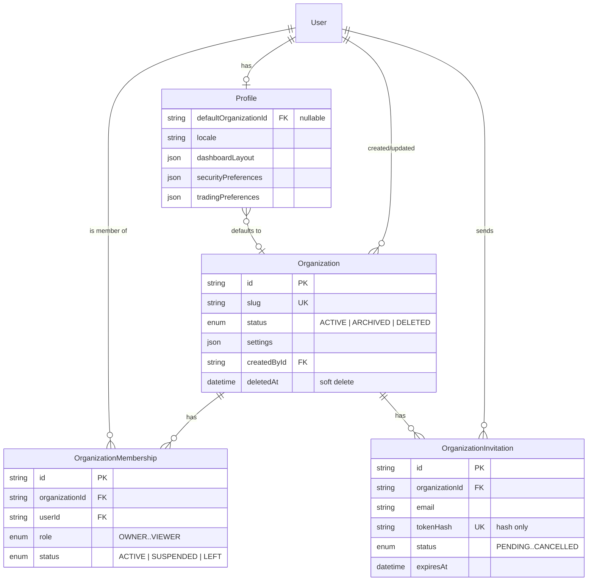

# Module 003 — User & Organization Management
## Phase 1: Specification, Architecture & Database Schema

Status: Complete — Awaiting Approval Before Phase 2 · Branch: `feature/module-003-user-organization`

This phase delivers the specification, architecture decisions, and Prisma schema only — no
repositories, services, controllers, or tests yet, per the phased delivery requirement. Nothing
in Module 001 or Module 002's *business logic* was touched. The only Module 002 file modified is
`packages/database/prisma/schema.prisma`, and every change there is additive: one new enum
value, a set of new nullable/defaulted columns on `Profile`, and new reverse relations on
`User`. Every existing Module 002 row, query, and caller keeps working unmodified.

---

## 1. Scope of This Module

Builds the Enterprise User & Organization Management platform: multi-tenant organizations
(workspaces), membership with per-organization roles, an invitation lifecycle, and extended
user preferences. This becomes the tenancy foundation every future module (Billing, AI,
Indicators, Notifications, Strategy Builder, Portfolio Management) depends on for "which
workspace is this data scoped to."

**Explicitly out of scope for Module 003** (per the prompt): authentication itself, platform
RBAC, session management, password policy — all owned by Module 002 and reused, never
duplicated.

## 2. Architecture Decisions (ADRs)

**ADR-006: Organization roles are a separate concept from Module 002's platform RBAC**
Module 002's `Role`/`Permission` tables answer "what can this user do on the platform"
(e.g., access the admin portal) — they're platform-wide. `OrganizationMembership.role`
answers "what can this user do inside *this* organization" — scoped per-workspace. These are
different questions with different lifecycles (a platform `SUPPORT` role doesn't imply
anything about being a `MANAGER` in a specific customer's organization). Rejected alternative:
extend Module 002's `UserRole.tenantId` (already present, always `null` today) to represent
organization scoping directly. Rejected because organization roles need a fixed, small,
product-defined vocabulary (Owner/Administrator/Manager/Analyst/Trader/Viewer) with
organization-specific semantics (e.g., only one `OWNER` per org, ownership transfer flows),
which doesn't map cleanly onto Module 002's fully-custom, admin-defined `Role` table. A user's
effective permission for an action will be the intersection of both systems — platform RBAC
still gates platform-level actions; `OrganizationMembership.role` gates organization-scoped
actions — resolved by an `OrganizationRoleGuard` in Phase 4, analogous to Module 002's
`RolesGuard`/`PermissionsGuard` but new, not a modification of them.

**ADR-007: User preferences extend `Profile`, not a new `UserPreference` table**
The integration requirement explicitly says reuse the existing User entity and never duplicate
what Module 002 owns. `Profile` already holds `timezone`, `language`, and
`notificationPreferences`. Module 003 adds `locale`, `country`, `theme`, `dashboardLayout`,
`defaultOrganizationId`, `securityPreferences`, `tradingPreferences`, and
`accessibilityPreferences` as new columns on the same row, rather than a parallel table that
would need its own 1:1 sync logic with `Profile`. All new columns are nullable or defaulted,
so the existing `profile: { create: {} }` call in Module 002's `UserRepository.create()`
continues to work unchanged — that repository method is not being touched in this module.

**ADR-008: Invitation tokens follow Module 002's existing hashed-token pattern exactly**
`OrganizationInvitation.tokenHash` mirrors `PasswordReset`/`EmailVerification`: SHA-256 hash
persisted, raw token emailed once, never stored. No new pattern introduced — Phase 3's
`InvitationService` will reuse the same hashing approach `AuthService` already uses (same
technique, new instance — not a shared function extracted from `AuthService`, since that
service is explicitly not to be modified and extracting from it would risk exactly that).

**ADR-009: Organization soft-delete uses status + `deletedAt`, mirroring `User`**
`Organization.status` (`ACTIVE`/`ARCHIVED`/`DELETED`) plus a `deletedAt` timestamp, set only
when transitioning to `DELETED` — same shape as `User.status` + `User.deletedAt` from Module
002. `ARCHIVED` is a distinct, restorable state (per the "Archive/Restore Organization"
capability in the spec) that does not set `deletedAt`. This consistency means Phase 2's
repository layer follows the exact same soft-delete query pattern
(`where: { deletedAt: null }`) already established for `User`.

**ADR-010: `ARCHIVED` added to `UserStatus`**
The functional spec's Account Lifecycle list (Active, Pending, Invited, Suspended, Locked,
Archived, Deleted) maps onto Module 002's existing `UserStatus` enum for every value except
`ARCHIVED` and `Invited`. `Invited` is modeled as `OrganizationInvitation.status = PENDING` —
a user can be invited to multiple organizations independently of their own account status, so
it doesn't belong on `User` itself. `ARCHIVED` is a genuine account-level state (distinct from
`DELETED`, restorable) and was added as one new enum value. This is the one place this module
touches a Module 002 file's schema — flagged explicitly, additive-only, and it's the kind of
"integration requirement" exception the prompt anticipates rather than a business-logic change.

## 3. Database Schema

### Entity-Relationship Diagram

### New Enums

| Enum | Values | Purpose |
|---|---|---|
| `OrganizationStatus` | `ACTIVE`, `ARCHIVED`, `DELETED` | Organization lifecycle |
| `OrganizationRole` | `OWNER`, `ADMINISTRATOR`, `MANAGER`, `ANALYST`, `TRADER`, `VIEWER` | Per-organization membership role |
| `MembershipStatus` | `ACTIVE`, `SUSPENDED`, `LEFT` | Membership state within an org |
| `InvitationStatus` | `PENDING`, `ACCEPTED`, `REJECTED`, `EXPIRED`, `CANCELLED` | Invitation lifecycle |
| `UserStatus` (extended) | `+ARCHIVED` | See ADR-010 |

### New Models

**`Organization`** — `id`, `name`, `slug` (unique), `logoUrl`, `description`, `timezone`
(default `UTC`), `currency` (default `USD`), `country`, `website`, `settings` (JSON, for
branding/regional-settings/default-permissions per the spec's Organization Settings section),
`status`, `createdById`/`updatedById` (audit fields per requirement), `createdAt`, `updatedAt`,
`deletedAt`. Indexed on `status` and `slug`.

**`OrganizationMembership`** — join table between `User` and `Organization`. `role`,
`status`, `invitedById`, `joinedAt`. Unique constraint on `[organizationId, userId]` — a user
has exactly one membership row per organization; role changes and suspensions update that row
rather than creating new ones. Indexed on `userId` and `[organizationId, status]` for the two
query patterns Phase 2/3 will need most ("all orgs for this user" and "active members of this
org").

**`OrganizationInvitation`** — `organizationId`, `email` (invitee may not have an account
yet — email, not `userId`), `role`, `tokenHash` (unique), `status`, `invitedById`,
`expiresAt`, `acceptedAt`. Indexed on `[organizationId, status]` (list pending invitations for
an org) and `email` (look up a user's pending invitations across orgs).

**`Profile`** — extended per ADR-007, listed in full in Section 4 below.

### Full Migration Diff Summary

- 1 enum value added (`UserStatus.ARCHIVED`)
- 4 new enums (`OrganizationStatus`, `OrganizationRole`, `MembershipStatus`,
  `InvitationStatus`)
- 3 new tables (`organizations`, `organization_memberships`, `organization_invitations`)
- 8 new nullable/defaulted columns on `profiles`
- 4 new indexes, 1 new unique constraint (`organization_memberships`), 1 existing-table index
  addition (`profiles.defaultOrganizationId`)
- 0 columns removed, renamed, or made non-nullable anywhere

## 4. Extended `Profile` Fields (full list, per the User Preferences functional requirement)

| Field | Type | Default | Maps to spec requirement |
|---|---|---|---|
| `locale` | `String?` | — | Locale |
| `country` | `String?` | — | Country |
| `theme` | `String` | `"system"` | Theme preference |
| `dashboardLayout` | `Json?` | — | Dashboard layout |
| `defaultOrganizationId` | `String?` (FK) | — | Default workspace |
| `securityPreferences` | `Json` | `{}` | Security preferences (presentation-layer only — see ADR-007's note; enforcement stays in Module 002) |
| `tradingPreferences` | `Json` | `{}` | Trading preferences |
| `accessibilityPreferences` | `Json` | `{}` | Accessibility |

(`language`, `timezone`, `notificationPreferences` already existed from Module 002 and are
reused unchanged, per "Timezone", "Language", "Notification preferences" in the spec.)

## 5. Acceptance Criteria for This Phase

- [x] Schema models every entity in the Functional Scope's Organization, Organization
      Membership, Invitation System, and User Preferences sections
- [x] Every new table has indexes on its primary query paths
- [x] Every relation that needs cascade-delete semantics has `onDelete: Cascade` (memberships/
      invitations die with their organization); every audit-style reference uses
      `onDelete: SetNull` (deleting the referenced user doesn't cascade-delete the organization
      they created)
- [x] Soft delete present on `Organization` (status + deletedAt), consistent with `User`
- [x] Audit fields (`createdById`/`updatedById`) present on `Organization`
- [x] Zero existing Module 001/002 columns changed, renamed, or removed
- [x] Brace-balance and relation-name-pairing manually verified (see Section 6 — full
      `prisma validate` could not run; see the honest caveat below)

## 6. Verification — What Could and Couldn't Run Here

Same sandbox limitation as every prior module: `prisma generate` needs `binaries.prisma.sh`,
which this sandbox's network allowlist blocks. This time I also tried `prisma validate` and
`prisma format` specifically to see if either uses a lighter-weight binary that might not be
blocked — both hit the identical 403, since both also depend on Prisma's schema/query-engine
binaries. So there is **no Prisma-tooling verification available to me for this schema in this
environment** — not even the lightest syntax check.

What I did instead, to give you real signal rather than none: verified brace balance (36 open,
36 close) and confirmed every named `@relation` appears exactly twice — once on each side —
which catches the most common hand-written-schema mistake (a relation declared on one model but
forgotten on its counterpart). This is not a substitute for `prisma validate`, and I'm not
presenting it as one. **The first real verification this schema gets should be `pnpm --filter
@rmsm/database generate && pnpm --filter @rmsm/database migrate:dev`** on a machine with normal
network access — that's true for every module so far, and remains true here.

## 7. What's Deferred to Later Phases (explicitly, not silently)

- Repositories, services, controllers, guards, DTOs — Phases 2–5
- Seed data (e.g., whether to seed a demo organization for local dev) — Phase 3, alongside the
  service that would create it, so seeding logic isn't written before the service it depends on
  exists
- Tests — Phase 6
- Final `MODULE_003_USER_ORGANIZATION.md` (architecture + API + permissions + workflow +
  acceptance criteria in one place) — Phase 7, once there's a complete implementation to
  document accurately rather than a schema-only preview of one

---

**Awaiting your review of the schema and these architecture decisions before I proceed to
Phase 2 (Repositories).** Two things worth flagging for a decision before I build on top of
them: (1) ADR-006's split between platform RBAC and organization roles — confirm that's the
model you want; (2) whether `OrganizationMembership` needs a `tenantId` reserved column for
some *other* future multi-tenancy dimension beyond "organization = tenant" (my read of the spec
is that Organization *is* the tenant boundary, so I didn't add one, but want to confirm before
Phase 2's repository queries are built around that assumption).
