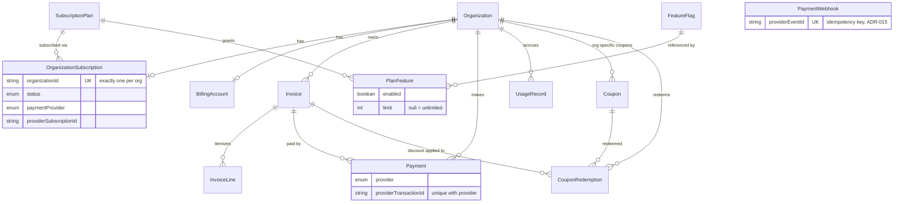
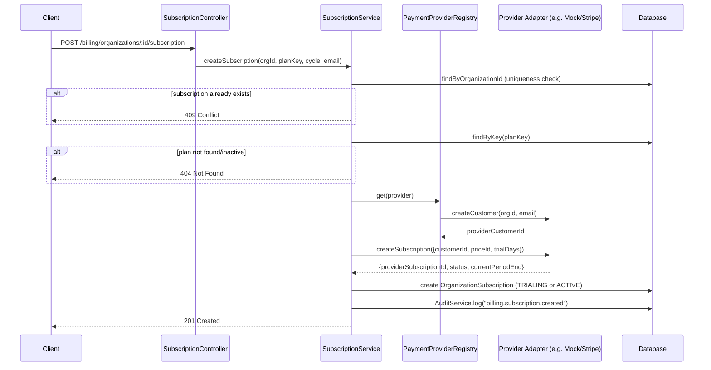
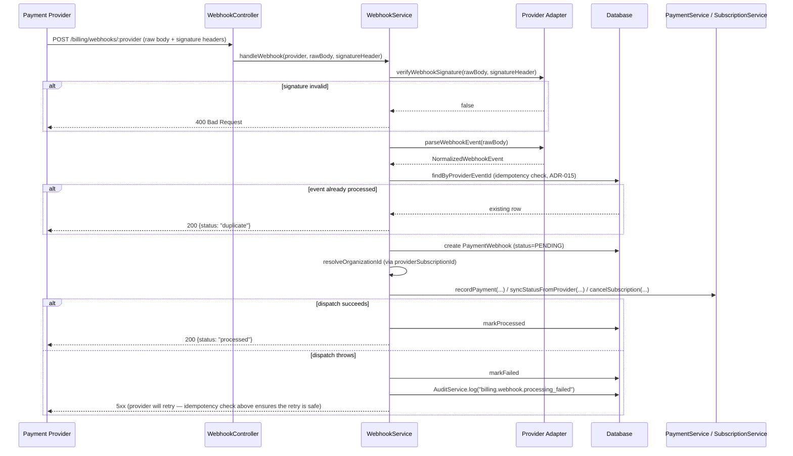
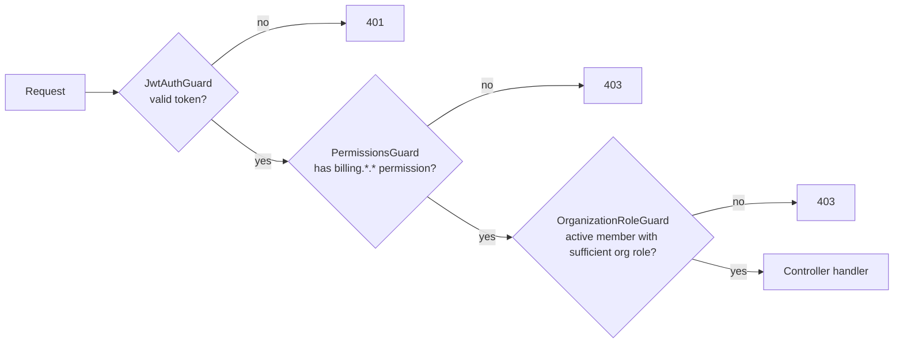
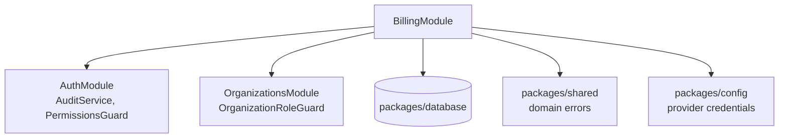

# Module 004 — Architecture Diagrams

## Entity-Relationship Diagram

## Sequence: Subscription Creation ("Checkout")

## Sequence: Webhook Processing (with idempotency)

## Authorization Layering (every organization-scoped billing endpoint)

## Module Dependency Graph

No module outside `BillingModule` depends on it yet — this module is a leaf in the current
dependency graph, ready for future modules (Strategy Builder, AI Analysis Engine, etc.) to
depend on it for `QuotaGuard`/`FeatureGuard` without `BillingModule` needing to know anything
about them.
