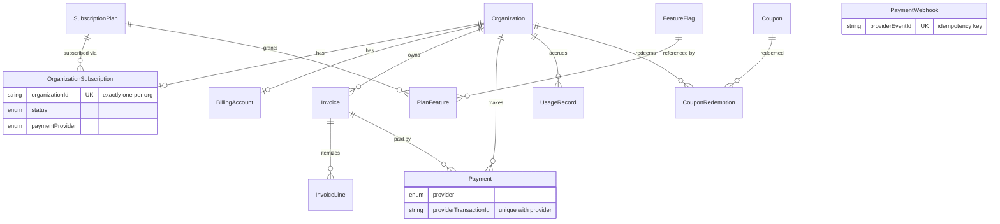

# Module 004 — Billing & Subscription Management
## Phase 1: Specification, Architecture & Database Schema

Status: Complete — Awaiting Approval Before Phase 2 · New branch recommended: `feature/module-004-billing`

Per the scale of this module (12 new models, 9 planned services, a full provider abstraction,
webhooks, quota/feature middleware — comparable in size to all of Module 003 combined), this
follows the same phased delivery pattern established there. This phase delivers specification,
architecture decisions, database schema, and the provider abstraction's interface definitions
only — no repositories, services, controllers, or provider implementations yet.

**Modules 001–003 are untouched except one additive schema change**: reverse relations added to
`Organization` (7 new relation fields — `subscription`, `billingAccount`, `invoices`, etc.),
none of which alter any existing column, query, repository, service, or controller. This is the
same category of change Module 003 made to Module 002's `Profile` and `UserStatus`, and follows
the same disclosure standard: every change is named explicitly, nothing is silent.

## 1. Scope Resolution — One Ambiguity Flagged, Not Guessed

The prompt's plan-tier list ("Free / Starter / Professional / Enterprise / Unlimited /
Support," one per line) is ambiguous about whether "Support" is a sixth tier. Resolved as 5
tiers (see ADR-014) — flagged explicitly rather than silently picking one reading, because
`SubscriptionPlan` rows are seed *data*, not schema, so getting this wrong costs a one-line
seed change in Phase 5, not a schema migration. Worth confirming now regardless, since Phase 3's
`SubscriptionService` will reference these plan keys by name.

## 2. Database Schema

### New Enums (5 explicitly named in the prompt + 4 additions, each flagged)

| Enum | Values | Status |
|---|---|---|
| `SubscriptionStatus` | ACTIVE, TRIALING, PAST_DUE, CANCELLED, EXPIRED, INCOMPLETE | Named in prompt |
| `BillingCycle` | MONTHLY, YEARLY | Named in prompt |
| `PaymentStatus` | PENDING, SUCCESS, FAILED, REFUNDED | Named in prompt |
| `InvoiceStatus` | DRAFT, OPEN, PAID, VOID, FAILED | Named in prompt |
| `PaymentProviderType` | STRIPE, MOCK, RAZORPAY, PADDLE, LEMONSQUEEZY | Named in prompt (as "PaymentProvider"; renamed to avoid colliding with Module 002's existing `OAuthProvider`-adjacent naming and the new `PaymentProviderAdapter` interface) |
| `PaymentMethod` | CARD, UPI, BANK, WALLET | **Addition** — needed for `Payment.method` per spec |
| `CouponType` | PERCENTAGE, FIXED_AMOUNT | **Addition** — needed for `Coupon.type` per spec |
| `FeatureType` | BOOLEAN, LIMIT | **Addition** — needed to distinguish on/off vs. numeric-capped features |
| `WebhookProcessingStatus` | PENDING, PROCESSED, FAILED | **Addition** — needed for webhook idempotency (ADR-015) |

### New Models (all 12 named in the prompt, exactly)

`SubscriptionPlan`, `FeatureFlag`, `PlanFeature`, `OrganizationSubscription`, `BillingAccount`,
`Invoice`, `InvoiceLine`, `Payment`, `Coupon`, `CouponRedemption`, `UsageRecord`,
`PaymentWebhook`. Full field-level detail is in `schema.prisma` — every model's docstring
explains its own design choices inline (money-as-cents, nullable-vs-required decisions,
cascade/set-null relation semantics) rather than duplicating that here.

**Two constraints worth calling out specifically:**
- `OrganizationSubscription.organizationId` is `@unique`, not just indexed — "each
  organization owns exactly one subscription" (spec, verbatim) is enforced at the database
  level, not just assumed by application code, matching this project's established
  defense-in-depth standard (ADR-004).
- `Payment` uniqueness is scoped to `[provider, providerTransactionId]`, not
  `providerTransactionId` alone — two different providers could theoretically produce
  colliding bare transaction-id strings.

### Entity-Relationship Diagram (abbreviated — full detail in schema.prisma)

## 3. Provider Abstraction (Section 12 of the prompt, delivered as architecture now)

`PaymentProviderAdapter` (`apps/api/src/modules/billing/interfaces/payment-provider.interface.ts`)
is the interface every provider implementation (Phase 3: `MockProvider`, `StripeProvider`) will
satisfy, and the only thing services depend on. Deliberately modeled after Module 002's
`OAuthProviderStrategy` — same registry pattern, same "raw HTTP against the provider's REST API,
no SDK dependency" approach that already worked for Google/GitHub/Microsoft OAuth. This directly
satisfies the prompt's "No Stripe SDK coupling."

`NormalizedWebhookEvent` is the provider-agnostic shape `WebhookService` (Phase 3) will consume —
signature verification and payload parsing are provider-specific (inside each adapter), but
everything downstream of that only ever sees this one normalized type.

## 4. What's Deferred to Later Phases

- `MockProvider` and `StripeProvider` implementations — Phase 3
- All 9 services, `PaymentProviderRegistry` — Phase 3
- Repositories — Phase 2
- Controllers, DTOs, subscription middleware/guards (`RequireActiveSubscription`,
  `RequireFeature`, `RequirePlan`, `RequireQuota`) — Phase 4
- Seed data (plan tiers, feature flags, plan-feature grants) — Phase 5, alongside the services
  that would create/reference them
- Tests, migration runbook, final verification — Phase 5

## 5. Verification

Same standard, same honest caveat as every phase of this project: `prisma validate`/`generate`
remain blocked by this sandbox's network policy. Manually verified: brace balance (63/63),
every named `@relation` present on both sides, no duplicate model/enum names, 32 models + 16
enums total after this phase's additions. This is not a substitute for real Prisma validation —
the first genuine check this schema gets should be `pnpm --filter @rmsm/database generate` on a
machine with normal network access, exactly as recommended for every module before this one.

---

**Awaiting your review before Phase 2 (Repositories).** Worth confirming before I build on top
of these decisions: (1) the 5-tier plan resolution in ADR-014 — correct reading, or was
"Support" meant as a sixth tier or something else entirely; (2) `PaymentProviderType` naming
(renamed from the prompt's "PaymentProvider" to avoid confusion with the new
`PaymentProviderAdapter` interface and Module 002's existing OAuth-provider-adjacent code) —
acceptable, or is there a reason to keep the exact name from the prompt.
