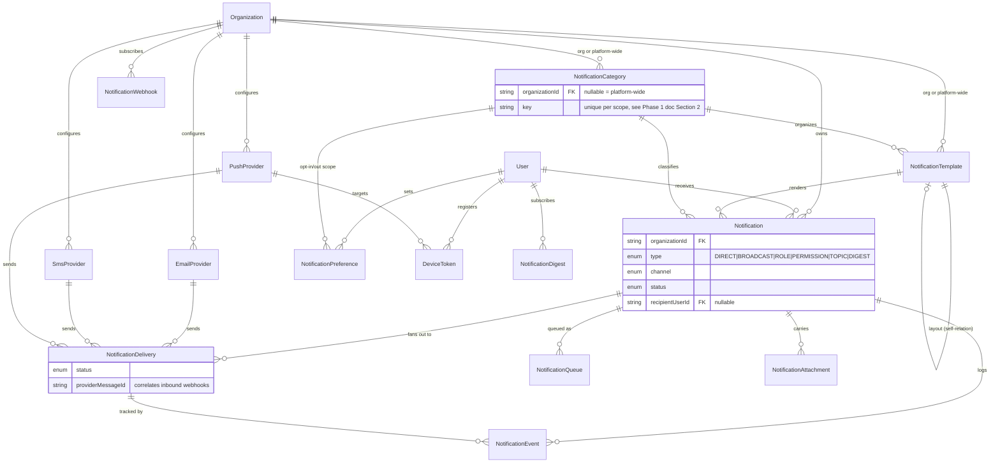
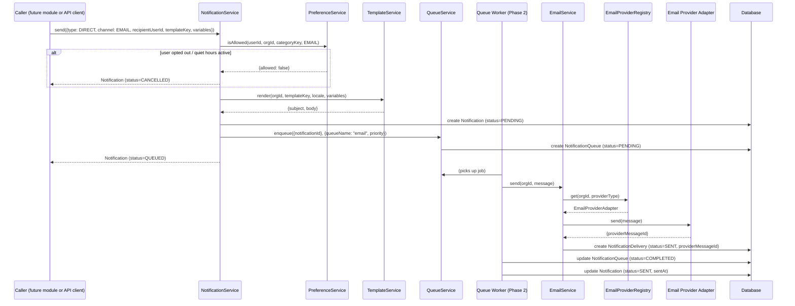
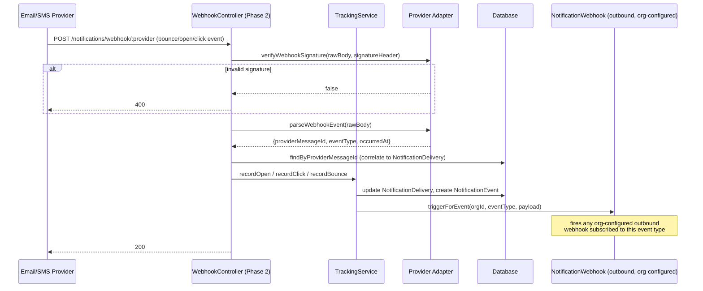
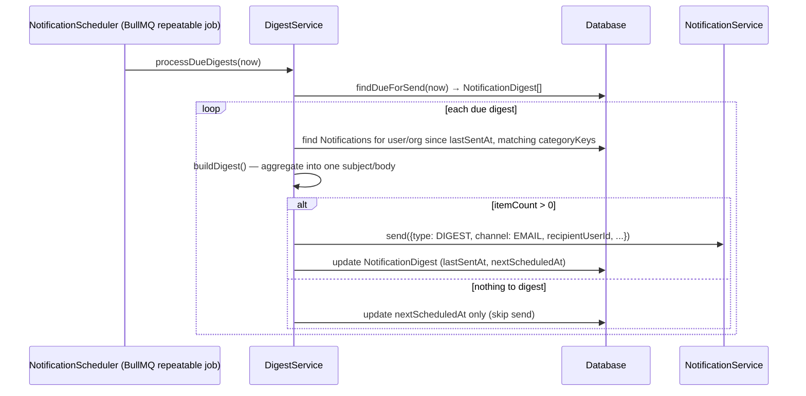
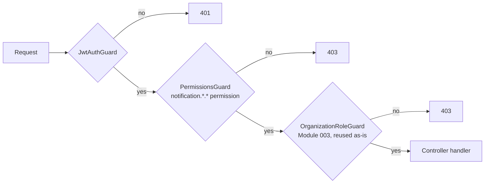
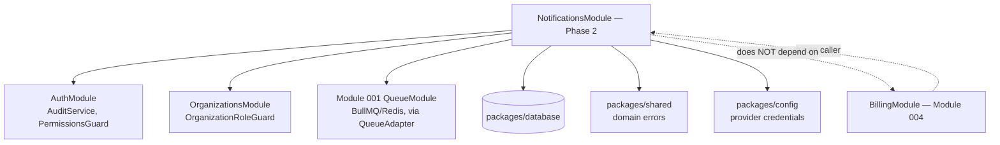

# Module 005 — Architecture Diagrams

## Entity-Relationship Diagram (core relationships)

## Sequence: Direct Notification Send (Email Channel)

## Sequence: Inbound Provider Webhook (Delivery Tracking)

## Sequence: Digest Generation

## Authorization Layering (organization-scoped notification endpoints, Phase 2)

## Module Dependency Graph

`BillingModule` will eventually call into `NotificationsModule` (e.g. "payment failed" →
notify the org owner) once both exist — the dependency arrow only goes one direction, matching
the layering this project has kept consistent since Module 003 (`OrganizationsModule` has no
dependency on anything built after it either).
