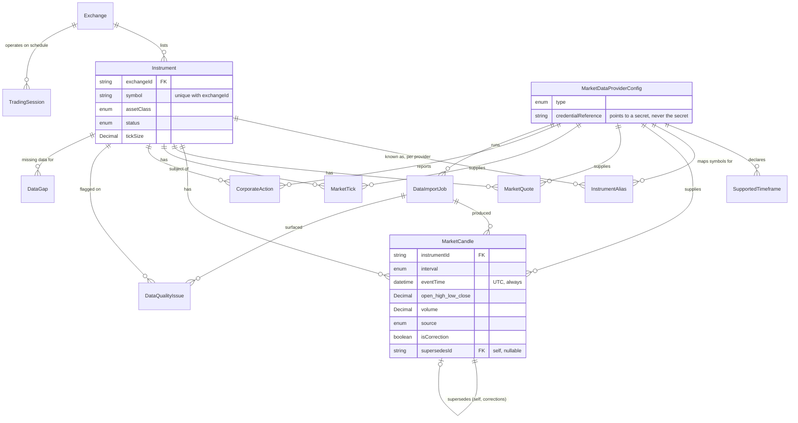

# AI-101 — Data Model

## Entity-Relationship Diagram

## Every Model, What It's For, and Why It Looks the Way It Does

### `MarketDataProviderConfig`
Non-secret provider configuration (base URL, rate limit, supported asset classes) plus a
`credentialReference` string pointing to wherever the actual secret lives (a secrets manager
path/key) — never the credential itself, per this phase's explicit "do not add real API keys
or secrets" instruction. This is a deliberate departure from EP-004/EP-005's
`credentialsEnc`-stored-here pattern; see the schema's own inline comment (Section 3 of the
design-resolution block) for the full reasoning.

### `Exchange`
One row per trading venue (NYSE, NASDAQ, Binance, etc.). `timezone` is an IANA identifier
string (e.g. `"America/New_York"`), never a fixed UTC offset — handles DST correctly, and is
the concrete mechanism behind the prompt's "never use local server time as market time"
standard.

### `TradingSession`
An exchange's open/close schedule, potentially more than one per exchange (pre-market, regular,
after-hours). `openTime`/`closeTime` are local time-of-day strings, interpreted against the
parent `Exchange.timezone` — not a Postgres `time` column, which would leave the timezone
ambiguous.

### `SupportedTimeframe`
Which `CandleInterval` values a given provider actually offers — not every provider supports
every interval (a crypto venue might not offer `ONE_MONTH` candles directly).

### `Instrument`
The canonical, provider-agnostic security master record — one row per (exchange, symbol) pair.
Every other market-data table references an `Instrument`, never a provider's own symbol string
directly. `tickSize`/`lotSize` are `Decimal`, matching the prompt's explicit no-floating-point
requirement for financial values.

### `InstrumentAlias`
A provider's own code/symbol for an `Instrument` this system already has under its canonical
identity — e.g. one provider might call an instrument `"BTCUSDT"` while this system's canonical
symbol is `"BTC-USD"`. Ingestion (Phase 2+) resolves through this table before writing any
time-series row, which is why `MarketCandle`/`MarketQuote`/`MarketTick` only ever reference
`instrumentId`, never a raw provider symbol.

### `MarketCandle`, `MarketQuote`, `MarketTick`
The time-series core. Each embeds its own lineage fields (`providerId`, `source`, `receivedAt`,
`sourceTimestamp`) rather than joining to a separate lineage table — a deliberate performance
tradeoff for the highest-read-volume tables in this entire subsystem (see the schema's Section 2
design-resolution comment). `MarketCandle` additionally carries `importJobId` and
`normalizationVersion` (which historical-import run produced this row, and which version of the
normalization logic).

`MarketCandle`'s idempotency constraint — `@@unique([instrumentId, interval, eventTime,
source])` — is the prompt's explicit example, applied literally. `source` is part of the key
deliberately: the same (instrument, interval, eventTime) can legitimately have both a `LIVE` row
and a later `HISTORICAL_IMPORT` row reconciling it, and that isn't a duplicate.

**Corrections** (`isCorrection`/`supersedesId`): a correction is always a new row pointing back
at the row it replaces, never an `UPDATE` — ADR-022. A future phase's read path needs to filter
for "the current best value per (instrument, interval, eventTime)" — that's query-layer logic
this schema doesn't (and structurally can't, in Postgres) enforce on its own.

### `CorporateAction`
Splits, dividends, mergers, symbol changes, delistings — the events that require historical
price/quantity adjustment. One `value` field covers every `type` (a split ratio, a dividend
amount) since a single row is always exactly one type; interpreting what `value` means for a
given `type` is a future adjustment-calculation service's job, not this schema's.

### `DataImportJob`
Tracks one synchronization/backfill run. `jobType` is a free-form string, not an enum — the
exact taxonomy of job types is a Phase 2+ synchronization-design decision this schema shouldn't
need a migration to accommodate (the same reasoning as EP-004's `UsageRecord.metric` and
EP-005's `NotificationEvent.eventType`).

### `DataQualityIssue`
A detected problem — a gap, a duplicate, an invalid value, whatever `issueType` (also
free-form, same reasoning as `jobType`) names. Links optionally to both the `Instrument` it
concerns and the `DataImportJob` that surfaced it.

### `DataGap`
A specific missing time range for one (instrument, interval) — the structured record a future
backfill workflow (`BackfillWorkflow`, `contracts/workflow.contracts.ts`) consumes and resolves.

## Timestamp and Precision Standards, Applied Concretely

- Every `DateTime` column that represents a market event is UTC — Postgres `timestamptz`
  (Prisma's default for `DateTime`), never a naive local timestamp.
- `eventTime` (when the thing actually happened, per the market) is always distinct from
  `receivedAt` (when this system wrote the row) and `sourceTimestamp` (the provider's own
  reported time, kept for audit/debugging when it differs from the normalized `eventTime`).
- Every price, size, and ratio is `Decimal`, never `Float`/`Int` — `@db.Decimal(24, 10)` for
  prices (room for both large index values and small crypto fractions), `@db.Decimal(30, 10)`
  for volumes (can be very large for high-volume instruments).

## Indexes, Matched to the Prompt's Named Query Patterns

| Query pattern (prompt's own wording) | Index |
|---|---|
| Symbol lookup | `Instrument @@unique([exchangeId, symbol])` |
| Exchange | `Instrument @@index([status])`, `Exchange` PK lookups |
| Asset class | `Instrument @@index([assetClass, status])` |
| Candle range | `MarketCandle @@index([instrumentId, interval, eventTime])` |
| Quote freshness | `MarketQuote @@index([instrumentId, eventTime])` |
| Import status | `DataImportJob @@index([providerId, status])`, `@@index([status])` |
| Data-quality state | `DataQualityIssue @@index([status, detectedAt])`, `@@index([instrumentId, status])` |

## A Real, Named Limitation: Nullable-Scope Uniqueness

None of this phase's models have the nullable-compound-unique-key issue EP-003/EP-004 hit
repeatedly (every unique constraint here is on non-nullable fields) — checked deliberately,
not just assumed clean, given that class of bug's history in this project.
