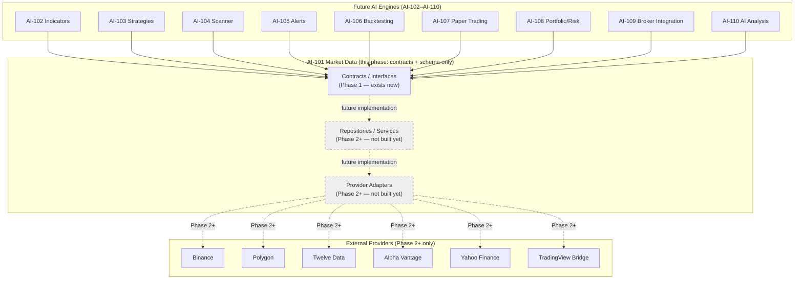

# AI-101 — Market Data Management
## Phase 1: Architecture, Data Contracts, Database Schema

Status: Complete — Awaiting Approval Before Phase 2

Per this prompt's explicit scope, this phase delivers architecture, database schema,
interfaces/contracts, DTOs, folder structure, and documentation only. **No repository,
service, controller, or provider implementation exists yet** — every `.ts` file this phase
delivers is a type/interface declaration, a DTO, or (in exactly one case, flagged below) a
small piece of genuinely pure, real, tested utility logic. This mirrors the identical Phase-1
discipline every EP module (002–005) applied at its own Phase 1.

## 1. Purpose and Boundary

AI-101 is the single authoritative source of market data for every future RMSM AI module
(AI-102 through AI-110). Per the prompt's explicit domain-boundary requirement: **no future
module may contact an external market-data provider directly.** Every candle, quote, tick, and
instrument any other module ever touches passes through AI-101's contracts first. This is the
same "one authoritative layer, everyone else consumes its contracts" shape as EP-004's
`ProviderRegistry` for payments and EP-005's for notifications — applied here to market data
specifically, at the very base of this product's dependency graph.

## 2. Reused, Not Recreated

Per the Verified Platform Baseline, this phase reuses EP-001 through EP-005 without
modification:

- **EP-002** (`PermissionsGuard`) will gate provider/admin operations once controllers exist
  (Phase 3+) — new `market-data.*` permission keys are a Phase 3 concern, not seeded this
  phase (no controller exists yet to gate).
- **EP-003** (`OrganizationRoleGuard`) is explicitly **not** used on any AI-101 model this
  phase, since none of them are organization-scoped (Section 5). It will apply to future
  organization-owned research artifacts (a saved chart, a custom watchlist) that reference
  AI-101 data — those belong in a future module, not here.
- **EP-004** feature entitlements (historical-data access tiers, API quotas) are named as a
  future integration point in the prompt; no `FeatureFlag`/`PlanFeature` rows are added this
  phase, since there is no data-access endpoint yet to gate.
- **EP-005** notifications will carry future provider-outage/backfill-failure/data-quality
  alerts (Phase 2+'s `ProviderOutageClassifier`/data-quality contracts, Section 6, are designed
  to hand off to `NotificationService.send()` eventually) — no notification category is seeded
  this phase, for the same "nothing to trigger it yet" reason as EP-002/EP-004 above.
- **Existing `AuditService` patterns** will apply to future sensitive mutations (manual
  corrections, provider credential changes) — not invoked this phase, since no service exists
  yet to call it.

**Zero EP module files were modified.** Every addition is new files under
`apps/api/src/modules/market-data/`, additive Prisma schema content, and new documentation.

## 3. Architecture Diagram



No future engine ever imports a provider adapter directly, and no provider adapter is ever
called except through this module's own services — the dependency direction the prompt
specifies (`Controllers -> Services -> Repositories -> Database`, `Providers -> Provider
contracts only`, `Future engines -> AI-101 contracts`) has no path for either shortcut.

## 4. Folder Structure

```
apps/api/src/modules/market-data/
├── constants/
│   ├── candle-interval.constants.ts   ← real logic (Section 8), tested
│   └── asset-class.constants.ts       ← reference data
├── contracts/
│   ├── detection.contracts.ts         ← gap/duplicate/out-of-order/invalid-value/stale-quote
│   └── workflow.contracts.ts          ← session validation, outage classification, backfill, manual correction
├── dto/
│   ├── candle-query.dto.ts
│   ├── instrument-search.dto.ts
│   └── quote-query.dto.ts
├── interfaces/
│   ├── normalized-market-data.interface.ts   ← the provider-agnostic shapes everything else speaks in
│   ├── market-data-provider.interface.ts     ← MarketDataProvider, MarketDataProviderFactory, ProviderRegistry
│   ├── historical-data-client.interface.ts
│   ├── quote-client.interface.ts
│   ├── symbol-search-client.interface.ts
│   ├── provider-rate-limit-policy.interface.ts
│   └── provider-error-mapper.interface.ts
├── repositories/    ← Phase 2+ (README.md explaining the deferral, no code)
├── services/        ← Phase 2+ (README.md explaining the deferral, no code)
├── providers/        ← Phase 2+ (README.md explaining the deferral, no code)
├── synchronization/  ← Phase 2+ (README.md explaining the deferral, no code)
├── validation/        ← Phase 2+ (README.md explaining the deferral, no code)
├── utils/             ← Phase 2+ (README.md explaining the deferral, no code)
└── __tests__/
    └── candle-interval.constants.spec.ts   ← real tests for the one real logic this phase has
```

## 5. The One Design Decision Worth Reading Twice: No `organizationId`, Anywhere

Every EP module built so far treats `Organization` as the tenant boundary. This module
deliberately does not — per the prompt's explicit "market data is product/global data by
default... do not add organizationId to globally sourced candles, quotes or instrument master
data unless there is a documented product need." No documented need exists this phase, so none
was added. Recorded as ADR-021 in `docs/ARCHITECTURE_DECISIONS.md` specifically because this is
the one place in this schema where following the pattern every prior module trained a reader to
expect would be the wrong move — flagged prominently rather than left to be discovered as a
surprising omission.

## 6. Data Quality Architecture

Nine contracts, covering every concern the prompt named, split into two files by whether they
*detect* a problem or *act* on one (Section 4's folder listing; full detail in
`AI_101_MARKET_DATA_PROVIDER_CONTRACTS.md`). The schema-level backing for the most important
one — corrections — is ADR-022: a correction is a new row, never an in-place update.

## 7. Acceptance Criteria

- [x] 13 new models, 10 new enums — additive only, verified via a scripted relation-pairing
      audit (92/92 owning relations correctly paired with a back-relation) and structural
      brace-balance check, not just "it looked right"
- [x] Zero `organizationId` anywhere in this schema section, deliberately (Section 5)
- [x] All financial values use `Decimal`, never float
- [x] UTC timestamps throughout; exchange timezone stored as IANA metadata, never assumed from
      server local time
- [x] `eventTime`/`receivedAt`/`createdAt`/`updatedAt` kept distinct wherever the data has a
      meaningful difference between "when it happened" and "when we saw it"
- [x] Idempotent-ingestion unique constraint on `MarketCandle` (instrument, interval, eventTime,
      source)
- [x] Corrections modeled as new rows, never overwrites (ADR-022)
- [x] Indexes for every query pattern the prompt named: symbol lookup, exchange, asset class,
      candle range, quote freshness, import status, data-quality state
- [x] Zero EP module files modified
- [x] `pnpm lint` 0 errors, `pnpm typecheck` 0 errors (verified against an extended stub; real
      `prisma generate` remains blocked in this sandbox, the same standing limitation as every
      module since EP-001 — see Section 9)
- [x] Zero TODOs/placeholders/bare `any` in any delivered file

## 8. The One Piece of Real Logic This Phase Has

`constants/candle-interval.constants.ts`'s `candleIntervalToMs()` — every other file this
phase delivers is types/interfaces with no runtime behavior. This one function is genuine,
deterministic domain knowledge every future phase needs (gap detection, synchronization
cadence, chart time-axis math), so it's implemented and tested for real now rather than
deferred alongside everything else — 3 tests, confirmed genuinely passing.

## 9. Verification

| Command | Result |
|---|---|
| `pnpm lint` (`@rmsm/api`, `@rmsm/database`) | ✅ 0 errors |
| `pnpm typecheck` (`@rmsm/database`, `@rmsm/api`) | ✅ 0 errors, first attempt — verified against an extended stub covering the full new AI-101 type surface |
| `pnpm test` | ✅ 59/59 (56 pre-existing + 3 new) |
| `pnpm build` | Same standing limitation as `typecheck` — blocked on real `prisma generate`, which this sandbox cannot run (network-blocked since EP-001) |

**The real Prisma schema validity check this schema has NOT yet had**: this sandbox cannot run
`prisma generate`/`validate`. A scripted relation-pairing audit (92/92 matched) and manual
structural checks catch the most common class of schema bug (an EP module discovered exactly
this class of bug in production use — see `docs/ARCHITECTURE_DECISIONS.md` ADR-020), but
neither is a full substitute for Prisma's own validator. The first real check this schema gets
must happen on a machine with real network access, per the same runbook every EP module's
Phase 1 has deferred to.

---

**Awaiting your review before Phase 2.** See `AI_101_MARKET_DATA_PHASE_2_PLAN.md` for what
Phase 2 will build once approved.
